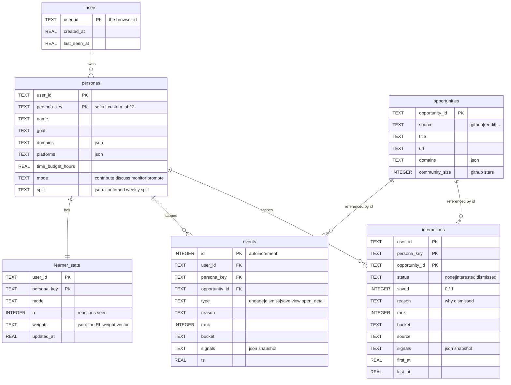
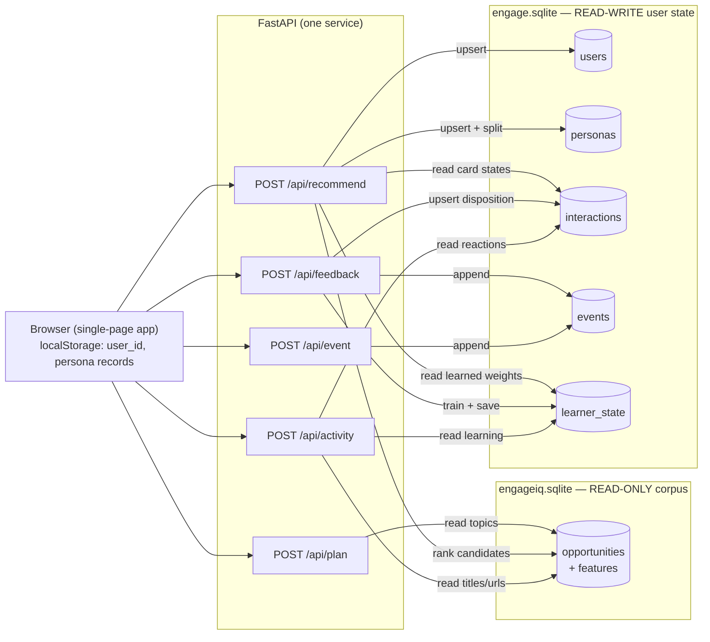

# EngageIQ — Database structure & data flow

EngageIQ uses **two SQLite databases, kept separate on purpose**:

| Database | Mode | Holds |
|---|---|---|
| `data/engageiq.sqlite` | **read-only** | the 20,995 opportunities + their features (the corpus). Built offline, never written at runtime. |
| `data/engage.sqlite` | **read-write** | all per-user state (created at runtime). |

Keeping them apart means the corpus stays a clean, reproducible snapshot while the user data is free to change.

Everything in `engage.sqlite` is scoped to **(user_id, persona_key)**: one browser = one `user_id` (a localStorage id, no login), and each persona a user picks or builds = one `persona_key`. `opportunities` lives in the *other* file, so `opportunity_id` is a logical reference across databases, not an enforced foreign key.

---

## 1. Schema (entity-relationship)

### Table by table
- **users** — one row per browser (the localStorage id): who showed up and when.
- **personas** — each profile a user picked or built, plus their confirmed weekly **split**. Rows are upserted, so editing a persona updates the same row in place (and keeps its learning).
- **interactions** — the heart of it. **One row per (user, persona, card)** = the *current* disposition: `status` (none / interested / dismissed), a `saved` flag, the dismissal `reason`, and a snapshot of the card's rank / bucket / source / signals. Idempotent: re-clicking updates this row, never duplicates it. This is what the feed restores on reload and what the Activity view reads.
- **events** — an **append-only history**: every click (engage / dismiss / save / page view / detail open) with the same signal snapshot. The substrate for the "what makes this user engage" analysis.
- **learner_state** — the **reinforcement-learning weight vector** per (user, persona): `n` reactions seen and `weights` (json). This is what tailors the ranking.
- **opportunities** *(in the read-only corpus)* — the source items the others point at by id.

---

## 2. How data flows

Read vs write at a glance:
- **`/api/plan`** reads the corpus (active topics). No user-state write.
- **`/api/recommend`** ranks against the corpus, reads the learned weights, **writes** `users` + `personas` (upsert), and reads `interactions` to restore each card's state.
- **`/api/feedback`** **writes** `interactions` (upsert), appends `events`, and trains + saves `learner_state`. Idempotent.
- **`/api/event`** appends `events`.
- **`/api/activity`** reads `interactions` + `learner_state` and joins titles/urls from the corpus.

---

## 3. The lifecycle in one line
Pick or build a persona → **`/api/recommend`** persists the persona and reads its learned weights → you react → **`/api/feedback`** upserts `interactions`, appends `events`, and trains `learner_state` → **`/api/activity`** reads it all back so you can see your reactions and what was learned → the next recommend loads the updated weights and re-ranks. The loop is closed.
