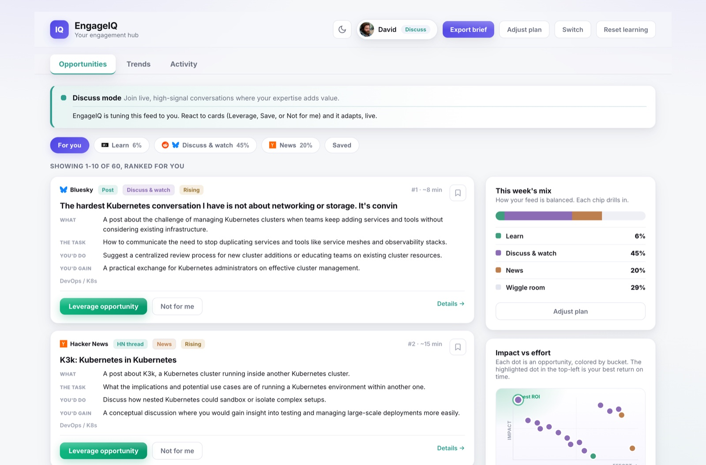
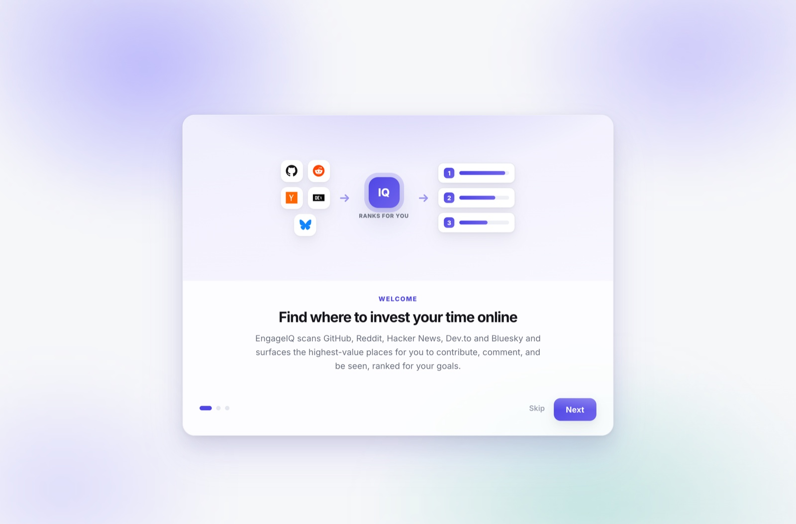
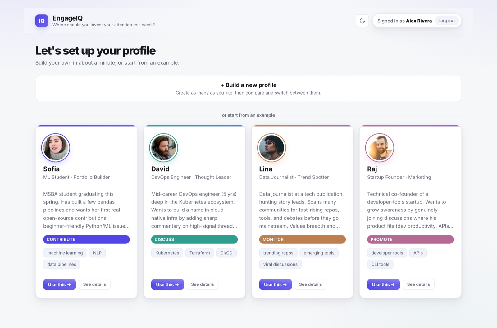
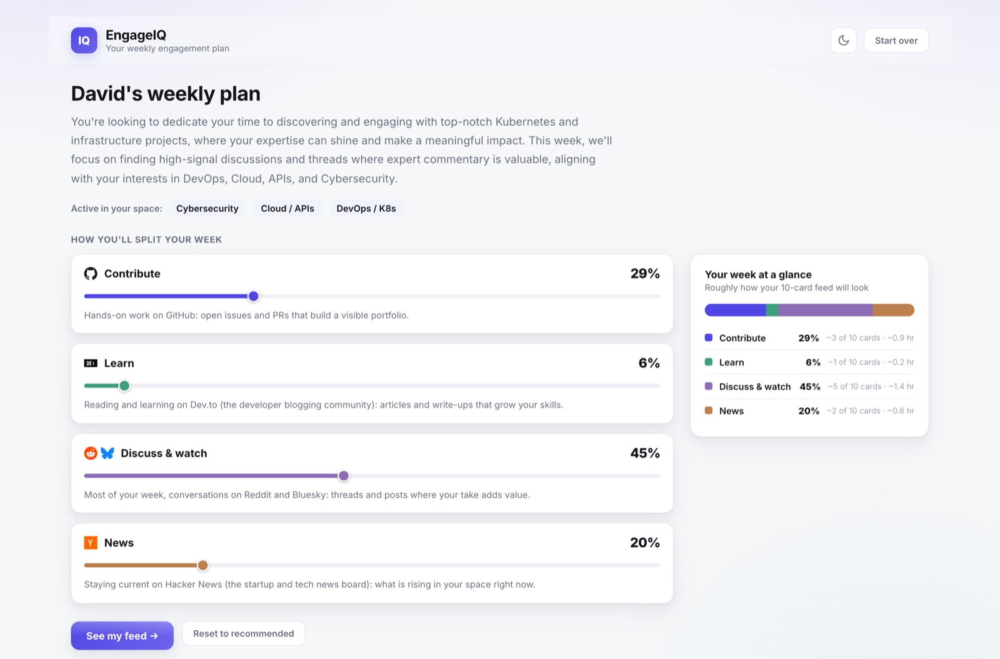
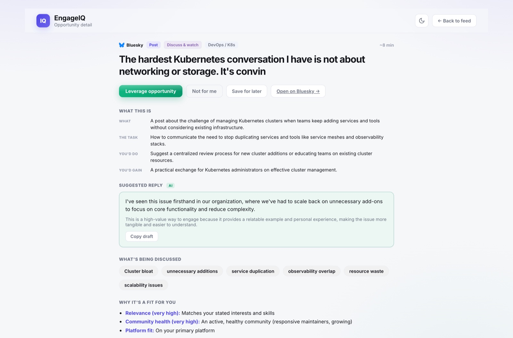
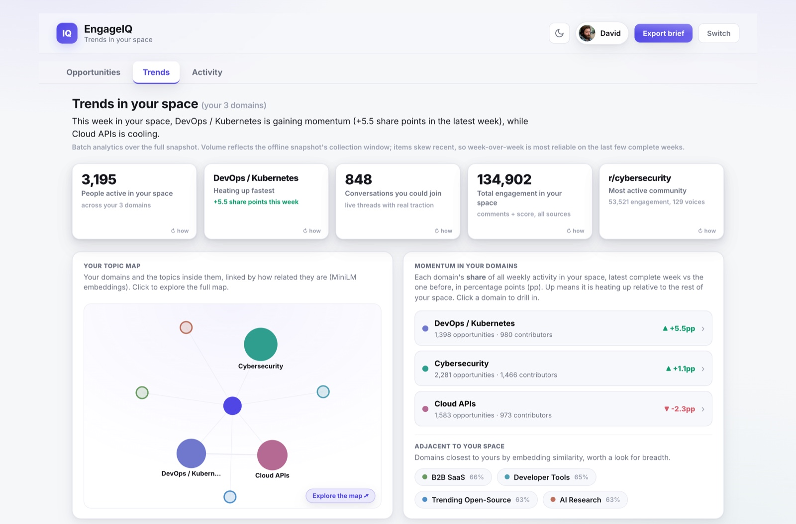
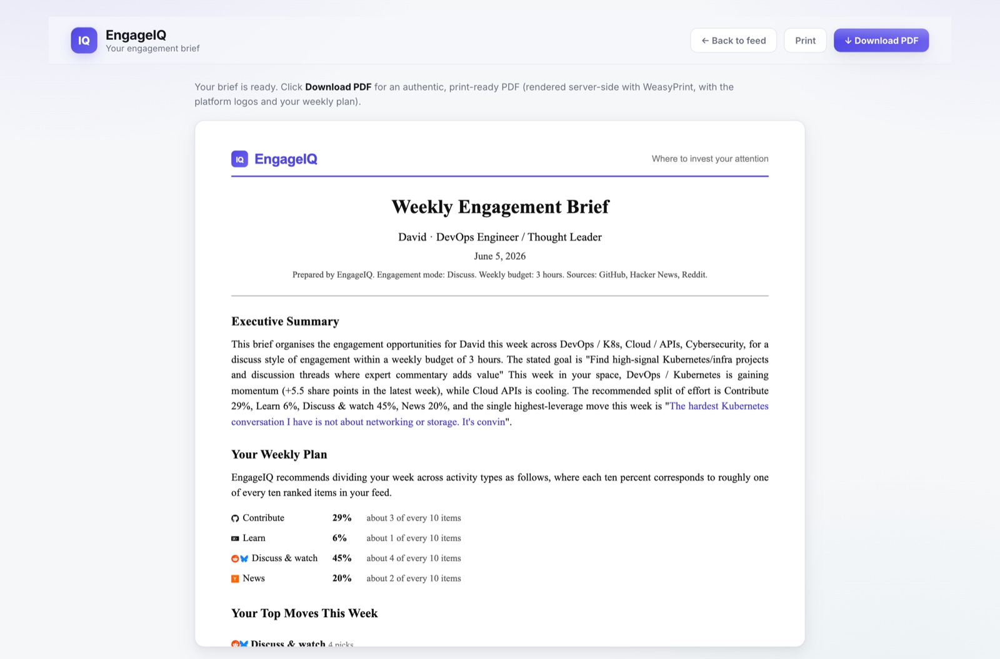

# EngageIQ — Smart Engagement Opportunity Scorer

> BAX-423 (Big Data) final project, UC Davis GSM. A full-stack, AI-assisted application that discovers, ranks, and learns from high-value engagement opportunities across GitHub, Reddit, Hacker News, Dev.to, and Bluesky, and helps a professional decide **where to invest their time online**.

**Live app:** https://engageiq-148810228333.us-central1.run.app (Google Cloud Run, public, no login needed)

It treats a unit of your attention as the item to recommend, and ranks opportunities by **expected impact per unit of effort** against a weekly time budget. Onboarding leads to a weekly Plan (you steer a Contribute / Learn / Discuss / News split), then a ranked feed with a plain-language "Why this?", an LLM-drafted suggested action, and feedback controls that the model learns from, plus a Trends tab and a downloadable engagement brief.

---

## Screenshots

A quick walk through the product, from onboarding to the exportable brief.

<p align="center"><em>The ranked engagement feed: every card explains why it surfaced, drafts a suggested action, and adapts to your reactions.</em></p>



|  |  |
| :--: | :--: |
|  |  |
| **Guided onboarding** | **Your profiles and four example personas** |
|  |  |
| **Your weekly plan (you steer the split)** | **Opportunity detail with an AI-drafted action** |
|  |  |
| **Trends in your space** | **The exportable engagement brief** |

---

## Run it

The app runs **with no API keys** against an **offline data snapshot** (`data/engageiq.sqlite`, 20,995 records across all 15 domains). That snapshot is **not committed to this public repo** (it is scraped public content that can contain third-party secrets); it ships in the Canvas submission, drop it into `data/` to run locally. The [live deployment](https://engageiq-148810228333.us-central1.run.app) already has it. LLM features (suggested actions, concepts) use cached outputs offline; set `NVIDIA_API_KEY` in `.env` for live generation.

### Option A — Docker (recommended, handles everything)

```bash
docker build -t engageiq .
docker run --rm -p 8080:8080 -e PORT=8080 engageiq
# open http://localhost:8080
```

### Option B — local Python (3.12)

```bash
python3 -m venv .venv && source .venv/bin/activate
pip install torch==2.12.0 --index-url https://download.pytorch.org/whl/cpu   # CPU build
pip install -r requirements-deploy.txt
# WeasyPrint (the PDF brief) needs native libs once: macOS -> brew install pango cairo gdk-pixbuf
uvicorn api:app --host 0.0.0.0 --port 8000 --app-dir code
# open http://localhost:8000
```

First start loads the two transformer models (cached after that).

---

## The six core capabilities

| # | Capability | Where |
|---|---|---|
| 1 | Multi-source ingestion + streaming + dedup + storage | `code/engageiq/collect.py`, Bloom-filter dedup, `data/engageiq.sqlite` (5 sources) |
| 2 | Embeddings + similarity retrieval (Sentence-BERT + ANN) | `code/engageiq/embed.py` / `retrieve.py` (MiniLM 384-d, FAISS; retrieval P@10 0.89) |
| 3 | Engagement scoring + multi-stage ranking + a metric | `features.py` / `score.py` / `rank.py` (cross-encoder + MMR; nDCG@10 0.711, 12/12 personas) |
| 4 | Adaptive learning from feedback (50+ rounds) | `feedback.py` + `store.py` (online bandit; nDCG@5 0.679 → 0.960 over 60 rounds) |
| 5 | Batch analytics & trend detection | `sketches.py` / `analytics.py` / `analytics_spark.py` / `/api/trends` |
| 6 | Dashboard + "Why this?" + suggested actions + downloadable brief | the SPA (`mockups/index.html`) + `/api/brief/pdf` |

---

## Tech stack

Python 3.12 · FastAPI · Sentence-BERT (`all-MiniLM-L6-v2`) + FAISS · `cross-encoder/ms-marco-MiniLM-L-6-v2` · SQLite · Count-Min Sketch + HyperLogLog (from scratch) · an online weight-learning bandit · WeasyPrint (PDF brief) · deployed as a single container on Google Cloud Run.

## Repository layout

```
code/         FastAPI app + the engine (engageiq/ package, sketches, analytics, api.py)
mockups/      the single-page product UI (index.html)
screenshots/  the product screenshots shown in this README
brief.pdf     the technical brief
Dockerfile    container build (CPU torch + models baked in)
DEPLOY.md     Google Cloud Run deployment steps
data/         offline corpus snapshot (ships in the Canvas submission, NOT this public repo)
```

## Documentation

- `brief.pdf` — the technical brief (architecture, technique choices and benchmarks, persona results, limitations)
- `DEPLOY.md` — how the container is built and deployed to Google Cloud Run

## Notes & limitations

The offline scrape skews recent, so trend signals use each domain's **share of weekly activity on complete weeks** (robust to that bias). Domain labels are multi-label re-classified (about 78% verified). GitHub is the smallest source, so Contribute-heavy profiles can see fewer GitHub items than requested. On the free Cloud Run instance, runtime accounts and learned weights are ephemeral (the read-only corpus and ranking are unaffected).

*Identity is name-only (no passwords): it scopes a user's profiles and learning, and is not a security boundary.*
